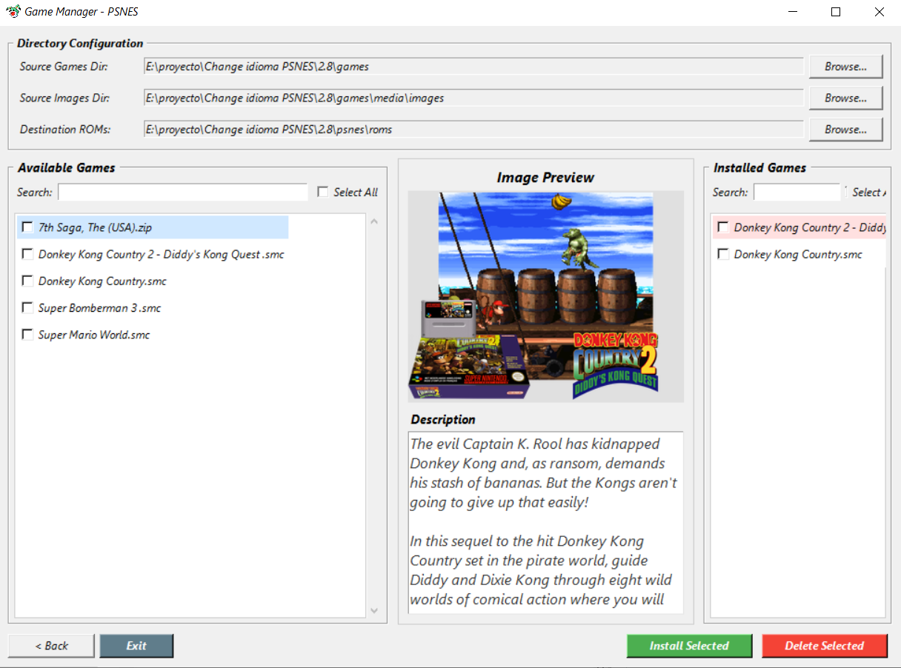

# PSNES Language Game Manager

A Python utility that changes the language of a PSNES installation and manages game installation/removal.

<p align="center">
  
  <br>
  <em>Program interface</em>
</p>

## Features

* Language selection.
* Automatic `gamelist.xml` installation.
* Automatic font replacement (`default.ttf`).
* Game manager with image preview.
* Install and remove games.
* Configurable source and destination directories.
* PyInstaller compatible.

## Requirements

* Python 3.10+
* Pillow

Install dependencies:

```bash
pip install pillow
```

Run:

```bash
python LanguageInstaller.py
```
Build .exe:

```bash
py -m PyInstaller --clean --onefile --windowed --icon=icono.ico --add-data "Languages;Languages" --add-data "font;font" --add-data "icono.ico;." LanguageInstaller.py 
```
## Instructions for Using Language-ManageSNES

Place it in the same directory as the psnes folder and the games folder (which is not included here). 
Run the Language-ManageSNES.exe file and you will be able to change the language.You will then have a 
game manager to add and remove games as you wish. Afterward, copy the psnes folder to the /data/homebrew/
directory on your PS5. Now you can run the SNES emulator. If you want to see a tutorial on how to use it, [visit my blog](https://tutosliberacionps5.blogspot.com/2026/07/instalar-emulador-psnes-snes9x-para.html).


## Note

The `games/` directory is not included in this repository because it may contain copyrighted ROMs and media files.
